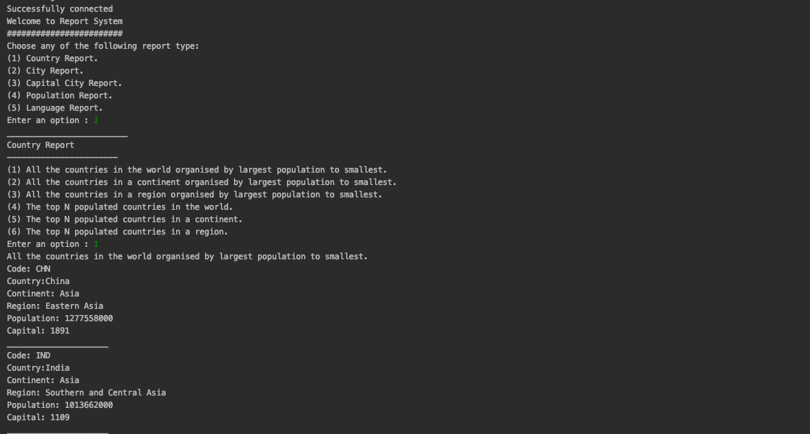
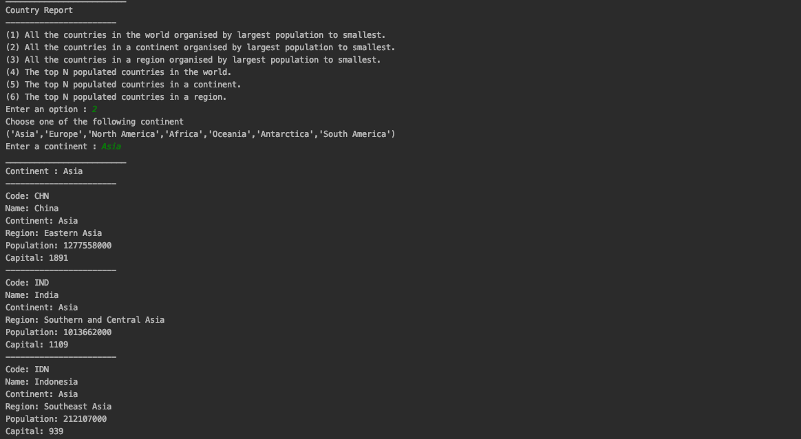
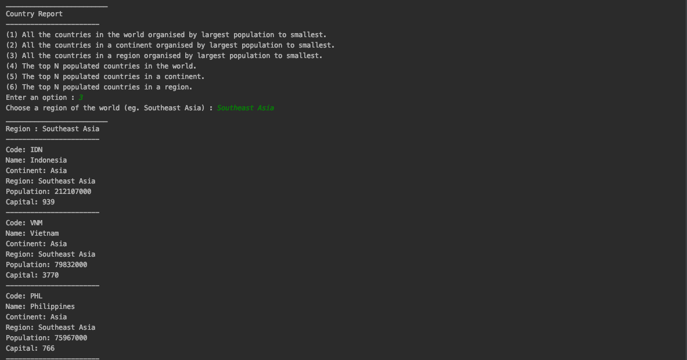

# DevOps Group1

| Role  | Member Name | ID |
| ------------- | ------------- |------------- |
| Scrum Master | Moe Myint Aung Moe | 40414312 |
| Product Owner  | Sat Naing | 40414307 |
| Team Member | Bhone Htut Kyaw | 40414311 |
| Team Member | Thant Zin Win | 40414305 |

# Software Engineering Method

- Master Build Status 
- License 
- Release 
- Develop Build Status 
- Code Coverage 

# Report 
| No. | Task Name | Done | Screenshot |
| --- | --- | --- | --- |
| 1 | All the countries in the world organised by largest population to smallest. | Yes |  |
| 2 | All the countries in a continent organised by largest population to smallest. | Yes |  |
| 3 | All the countries in a region organised by largest population to smallest. | Yes |  |
| 4 | The top N populated countries in the world where N is provided by the user. | Yes |  |
| 5 | The top N populated countries in a continent where N is provided by the user. | Yes |  |
| 6 | The top N populated countries in a region where N is provided by the user. | Yes |  |
| 7 | All the cities in the world organised by largest population to smallest. | Yes |  |
| 8 | All the cities in a continent organised by largest population to smallest. | Yes |  |
| 9 | All the cities in a region organised by largest population to smallest. | Yes |  |
| 10 | All the cities in a country organised by largest population to smallest. | Yes |  |
| 11 | All the cities in a district organised by largest population to smallest. | Yes |  |
| 12 | The top N populated cities in the world where N is provided by the user. | Yes |  |
| 13 | The top N populated cities in a continent where N is provided by the user. | Yes |  |
| 14 | The top N populated cities in a region where N is provided by the user. | Yes |  |
| 15 | The top N populated cities in a country where N is provided by the user. | Yes |  |
| 16 | The top N populated cities in a district where N is provided by the user. | Yes |  |
| 17 | All the capital cities in the world organised by largest population to smallest. | Yes |  |
| 18 | All the capital cities in a continent organised by largest population to smallest. | Yes |  |
| 19 | All the capital cities in a region organised by largest to smallest. | Yes |  |
| 20 | The top N populated capital cities in the world where N is provided by the user. | Yes |  |
| 21 | The top N populated capital cities in a continent where N is provided by the user. | Yes |  |
| 22 | The top N populated capital cities in a region where N is provided by the user. | Yes |  |
| 23 | The population of people, people living in cities, and people not living in cities in each continent. | Yes |  |
| 24 | The population of people, people living in cities, and people not living in cities in each region. | Yes |  |
| 25 | The population of people, people living in cities, and people not living in cities in each country. | Yes |  |
| 26 | The population of the world. | Yes |  |
| 27 | The population of a continent. | Yes |  |
| 28 | The population of a region. | Yes |  |
| 29 | The population of a country. | Yes |  |
| 30 | The population of a district. | Yes |  |
| 31 | The population of a city. | Yes |  |
| 32 | The number of people who speak the Chinese/English/Hindi/Spanish/Arabic languages from greatest number to smallest, including the percentage of the world population. | Yes |  |

